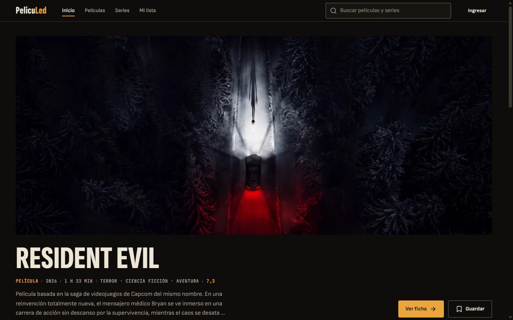
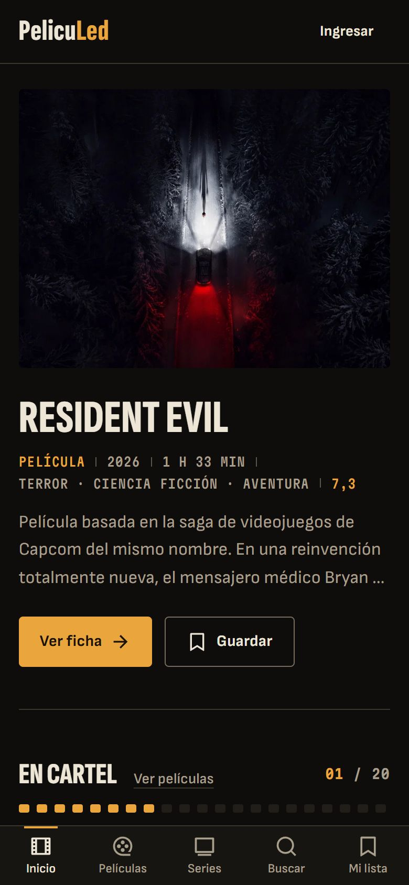
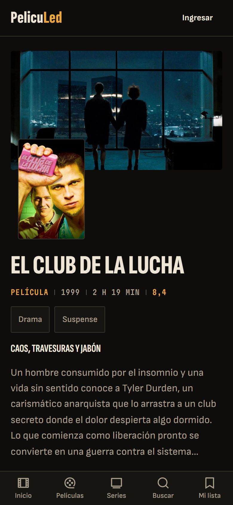
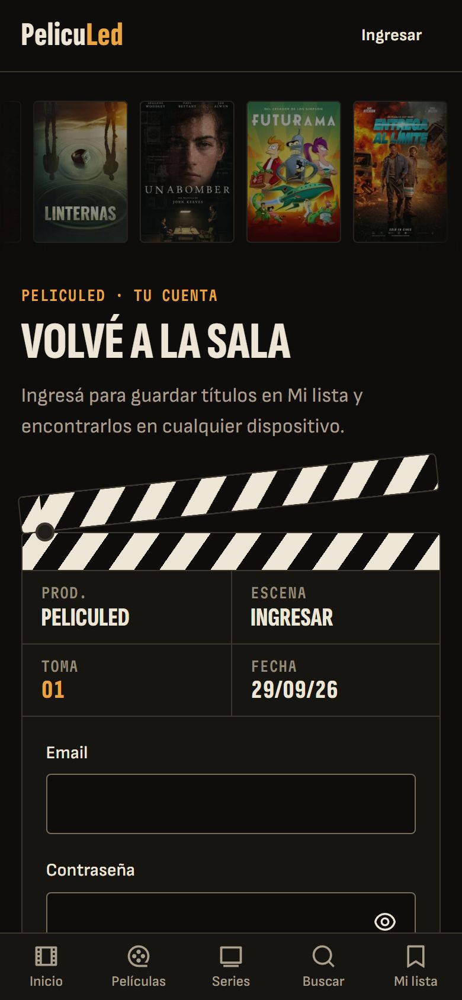
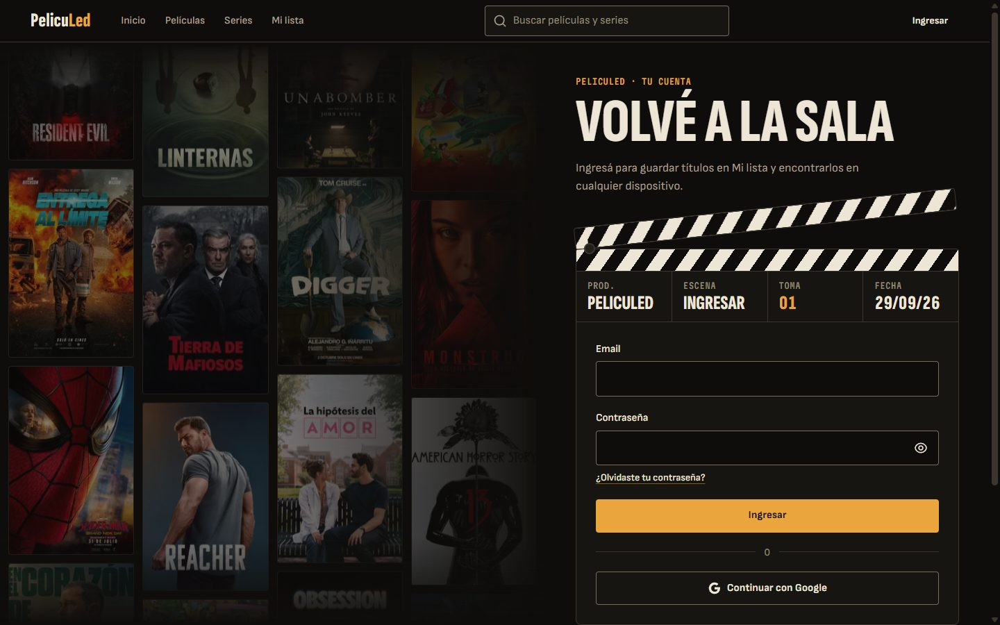

# PelicuLed

Catálogo de películas y series para decidir qué ver: lo que está en cartelera, lo más visto de la semana, fichas completas con reparto y tráiler, búsqueda, y una lista propia sincronizada entre dispositivos.

**Demo:** https://desafio-react-pi.vercel.app

<p>
  
</p>

<p>
  
  
  
</p>

<p>
  
</p>

## Qué hace

- **Inicio:** el título más visto de la semana "proyectado", y rieles de cartelera, series de la semana y mejor puntuadas.
- **Películas y Series:** catálogo con filtro por género y orden (populares, mejor puntuadas, recientes), todo en la URL para poder compartirlo, con "cargar más".
- **Ficha:** backdrop, sinopsis, reparto (cada persona tiene su página), tráileres y ficha técnica. Al abrir un título, el póster se expande hasta el backdrop (View Transitions).
- **Búsqueda:** películas, series y personas en una sola búsqueda, con debounce y la consulta en la URL.
- **Mi lista:** cuenta con email o Google; los títulos guardados viven en Firestore por usuario, se filtran por tipo y se pueden quitar con "deshacer". Si había favoritos guardados en el navegador (versión anterior), se migran solos a la cuenta.
- **Cuenta como set de rodaje:** ingresar, registrarse y recuperar la contraseña pasan en una claqueta: cada envío la hace golpear y un intento fallido sube la "toma", con los afiches de la semana derivando de fondo.
- **Navegación pública:** solo Mi lista pide cuenta; quien intenta guardar sin sesión vuelve a donde estaba después de ingresar.

## Stack

| Área           | Elección                                                                                      |
| -------------- | --------------------------------------------------------------------------------------------- |
| Base           | React 19, TypeScript 6 (strict, `noUncheckedIndexedAccess`), Vite 8                           |
| Ruteo          | React Router 8 en modo data: rutas lazy por pantalla, redirecciones de las URLs viejas        |
| Datos          | TanStack Query 5 (`queryOptions`, infinite queries) contra un proxy propio de TMDB            |
| Estilos        | Tailwind CSS 4 con tokens en `@theme` ([`DESIGN.md`](DESIGN.md)), Headless UI 2, Remix Icon   |
| Animación      | Motion (`LazyMotion`, features diferidas) y View Transitions para la transición de ventanilla |
| Cuenta y datos | Firebase Auth (email y Google) y Firestore con reglas por usuario                             |
| Calidad        | Vitest + Testing Library, Playwright + axe, ESLint (jsx-a11y), Prettier, GitHub Actions       |
| Deploy         | Vercel: sitio estático + una función serverless para el proxy                                 |

## Decisiones que vale la pena contar

**La key de TMDB nunca llega al navegador.** Todas las llamadas van a `/api/tmdb/*`, una función de Vercel ([`api/tmdb/[...path].ts`](api/tmdb/%5B...path%5D.ts)) que agrega el token del lado del servidor, solo deja pasar los endpoints que la app usa y cachea en el CDN (`s-maxage`). En desarrollo, el proxy de Vite hace lo mismo. Un build de producción no contiene ni la key ni el token.

**Rendimiento medido y con presupuesto.** Firestore se carga recién cuando alguien inicia sesión y Firebase Auth después del primer render; el menú de cuenta solo existe para usuarios con sesión. El HTML pide los datos del destacado y precarga su imagen mientras baja el JS, y los skeletons tienen la geometría exacta del contenido.

|                                  | Antes de la fase 4 | Ahora                                                             |
| -------------------------------- | ------------------ | ----------------------------------------------------------------- |
| JS de la primera visita (gzip)   | ~247 kB            | 146 kB, con Motion incluido (presupuesto: 150 kB, lo controla CI) |
| Descubrimiento de la imagen LCP* | 4,3 s              | 0,6 s                                                             |
| CLS*                             | 0,09               | 0,00                                                              |

\* Medido en laboratorio con 4G lento y CPU 4× más lenta, contra el build local.

**Accesibilidad como requisito (WCAG 2.2 AA).** Contrastes calculados por token, foco visible en todo, targets de 44 px, formularios con errores vinculados y foco en el primer campo con problema, `prefers-reduced-motion` respetado, idioma declarado. Los tests e2e corren axe en cada pantalla clave y fallan ante cualquier violación AA. Lighthouse (mobile): 100 en accesibilidad, buenas prácticas y SEO en inicio, ficha, catálogo, búsqueda e ingresar.

**Una identidad propia, no un clon de streaming.** La dirección "Borde de 35 mm" trata el catálogo como un rollo de película: cada título es un cuadro y sus datos se imprimen como el código de borde de la copia. Dos suelos: proyección (negro cálido) para explorar y mesa de luz (crema) para tu lista; la cuenta es un set de rodaje con claqueta. Las animaciones son cortas y con propósito, y respetan `prefers-reduced-motion`. Está documentada en [`DESIGN.md`](DESIGN.md).

**Errores que ayudan.** Todos los mensajes de Firebase están traducidos a un español que dice qué hacer; las pantallas que fallan muestran el error dentro de la app con una salida; si un deploy deja una pestaña vieja sin sus chunks, pide recargar en vez de romperse.

## Estructura

```
api/tmdb/            Proxy serverless de TMDB (allowlist, token, caché) + tests
src/
  app/               Router, rutas, paths, QueryClient
  routes/            Una carpeta por pantalla (lazy)
  features/          Lógica por dominio: auth, catalog, title, people, favorites
  components/ui/     Sistema de componentes (Button, Field, Poster, Rail, Dialog…)
  layouts/           Shell: header, tab bar, menú de cuenta
  services/          Clientes de TMDB y Firebase
  styles/            Tokens y CSS base
e2e/                 Flujos en Playwright con TMDB y Firebase interceptados
docs/redesign/       Plan del rediseño y lámina de dirección visual
```

## Correrlo localmente

Requisitos: Node 22.12 o superior, una cuenta de [TMDB](https://www.themoviedb.org/settings/api) y un proyecto de Firebase con Authentication (email y Google) y Firestore.

```bash
git clone https://github.com/FelipeJuaneda/desafioReact.git
cd desafioReact
npm install
cp .env.example .env.local   # completá los valores (ver comentarios en el archivo)
npm run dev                  # http://localhost:3000
```

Las reglas de Firestore están en [`firestore.rules`](firestore.rules) y se publican con `npx firebase-tools deploy --only firestore:rules`.

### Scripts

| Script                                                        | Qué hace                                                               |
| ------------------------------------------------------------- | ---------------------------------------------------------------------- |
| `npm run dev`                                                 | Servidor de desarrollo con el proxy de TMDB                            |
| `npm run build` / `npm run preview`                           | Build de producción y servidor para probarlo                           |
| `npm run test`                                                | Tests unitarios y de integración (Vitest)                              |
| `npm run e2e`                                                 | Flujos en el navegador con chequeo de accesibilidad (Playwright + axe) |
| `npm run lint` / `npm run typecheck` / `npm run format:check` | Calidad de código                                                      |
| `npm run size`                                                | Presupuesto de JS inicial (después de `build`)                         |

## Créditos

Datos e imágenes de [TMDB](https://www.themoviedb.org/). Este producto usa la API de TMDB pero no está avalado ni certificado por TMDB.

Hecho por [Felipe Juaneda](https://github.com/FelipeJuaneda).
